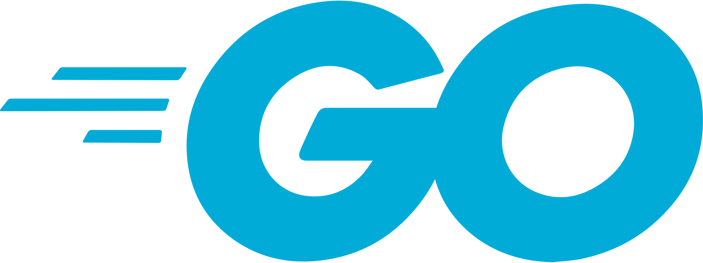

# Introducción a Golang

  	

[Go (a.k.a. Golang)][go] es un lenguaje de programación open source desarrollado por Google y muchos [contribuyentes][contributors].

[contributors]: https://golang.org/CONTRIBUTORS
[go]: https://golang.org/
